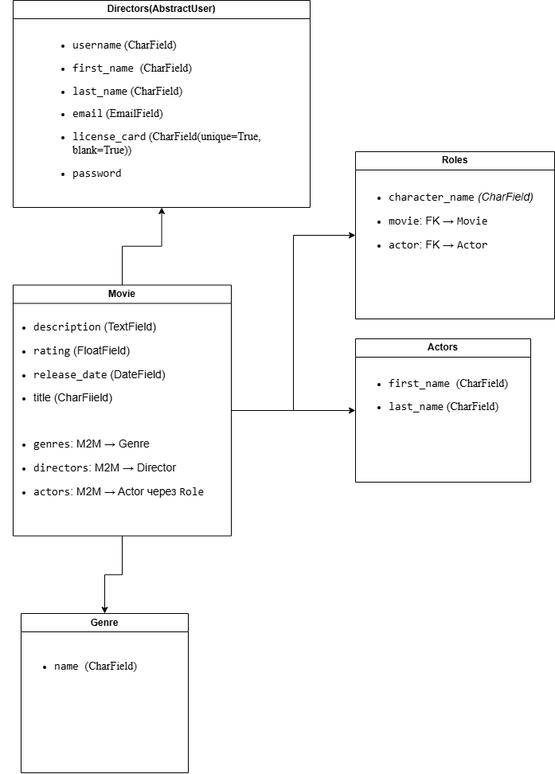

# MovieCore

Кінобаза для справжніх режисерів!  
MovieCore — це Django-застосунок для створення, перегляду та адміністрування фільмів, акторів, жанрів і режисерів із автентифікацією та гнучкими ролями.

---

---

## ⚙️ Встановлення проєкту

git clone https://github.com/your-username/moviecore.git
cd moviecore

# Створити віртуальне середовище
python -m venv .venv
source .venv/bin/activate

# Встановити залежності
pip install -r requirements.txt

# Застосувати міграції
python manage.py migrate

# Завантажити демо-дані (опційно)
python manage.py loaddata movie_core_db_data.json

# Створити суперкористувача (для доступу в адмінку)
python manage.py createsuperuser

Або використовуй admin.user  
                 1qazcde3

# Запустити сервер
python manage.py runserver

Режисери
Реєстрація: /register/

Формат ліцензії обов'язковий: AA123456 (2 великі літери + 6 цифр)

Без ліцензії створення фільму неможливе

Вхід / вихід: /login/ / /logout/

Функціонал сайту
Фільми: створення, редагування, видалення, ролі акторів через FormSet, прив'язка жанрів

Актори: сторінки з деталями, пошук, видалення

Жанри: лічильник фільмів, створення, пошук, видалення

Режисери: список, профілі, пошук, редагування себе

Ролі: персонажі, прив’язка між актором та фільмом

Головна: статистика + топ-3 фільми

Сторінки захищені: доступ лише після входу

На сторінках movies/, actors/, genres/, directors/ реалізований пошук:

python manage.py test

Тести покривають:

Валідацію форми реєстрації (license_card)

Пошук по списках

Перевірку переходів (detail-view)

Сторінки логіну, реєстрації, виходу

